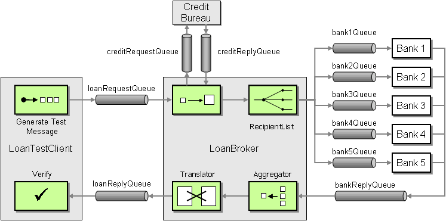

# Loan Broker

High level schema is page 402 of
[Enterprise Integration Patterns](https://www.enterpriseintegrationpatterns.com/).



## Dependencies

RabbitMQ docker image

```
docker run -it --rm --name rabbitmq -p 5672:5672 -p 15672:15672 rabbitmq:3-management
```

Redis (for the aggregator)

key = customer SSN

on each message in `bankReplyQueue` we can push to Redis using `LPUSH` until
`LLEN` matches the `expected_bank_replies`

Then we publishes the response to the Translator

## Queues list

- `loanRequestQueue`
- `creditRequestQueue`
- `creditReplyQueue`
- `bankNQueue` (n is 1..6)
- `bankReplyQueue`
- `loanReplyQueue`

### Error/Invalid Queue

- `invalidLoanRequestQueue`

## Components

### Component: Generate Test Loan Request Message

- Fake customer personal info
- Request a loan

### Component: Credit ScoreContent Enricher

- Consumes `loanRequestQueue`
- Send message to `creditRequestQueue`
- Consumes `creditReplyQueue`
- Invoke `RecipientList`

### Component: Recipient List

- Receive an input (`consumer_credit_score`)
- Returns an array of bank names to send the application to
- Fan out the loan request to all the bank queues

### Component: Bank _n_

- Consume from `bankNQueue`
- If accepted, return loan proposal by sending message to `bankReplyQueue`

### Component: Aggregator

- For loan application with ID `12345`
- Wait for _n_ responses from the bank (where _n_ is either a min. quantity of
  replies or the number of banks for the recipient list component)

### Component: Translator

- Filter out rejected bank application
- Select the most advantageous (read: cheapest)
- Send the `0..1` (because all banks might have rejected) to the
  `loanReplyQueue`

### Component: Verify

**Scenario 1**

input: Customer Jane Doe\
amount loan: \$10k\
credit score: 820 \expected loan: Bank1 with 2% interest rate

**Scenario 2**

input: Customer Jack Doe\
amount loan: \$100k\
credit score: 540\
expected loan: all rejected

**Scenario 3**

input: Customer John Doe\
amount loan: \$5k\
credit score: 730\
expected loan: Bank3 at 2.5% (while bank2 also returned an accepted loan at 3%)

## Nice to have / roadmap

- https://github.com/ddollar/foreman

Create a `Procfile` to start all our Ruby scripts
